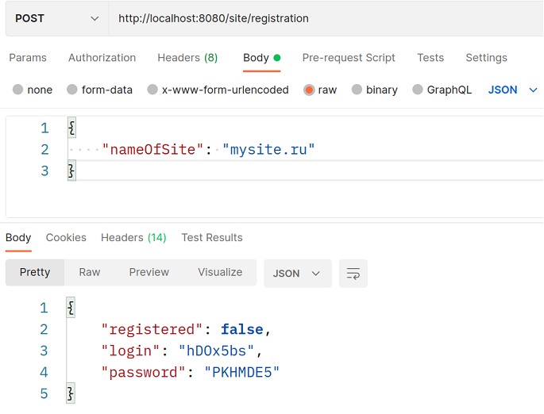
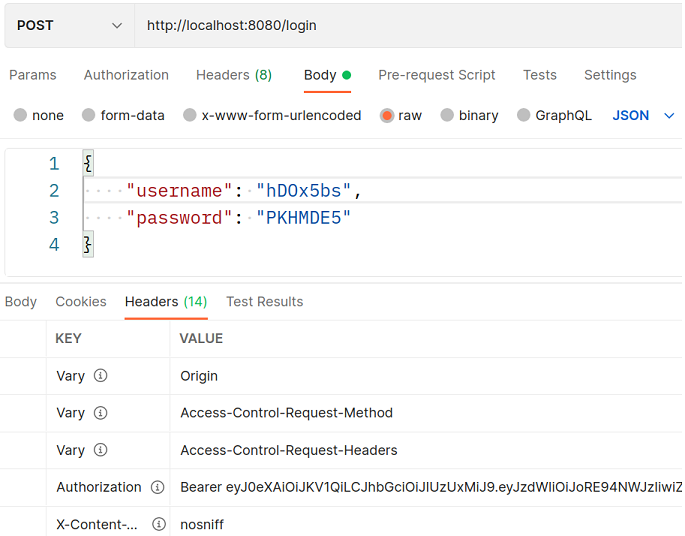
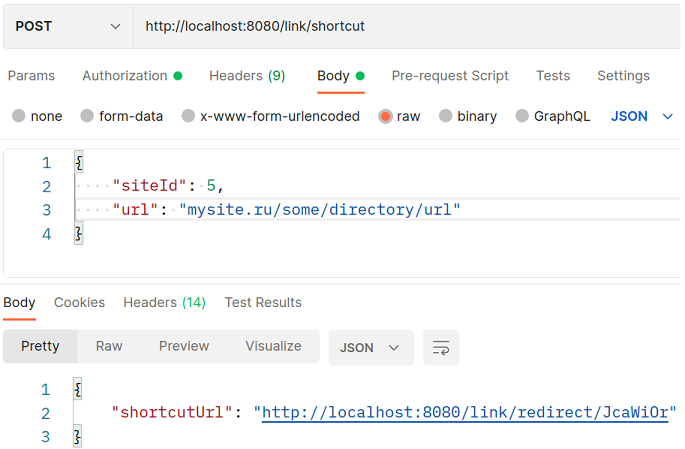
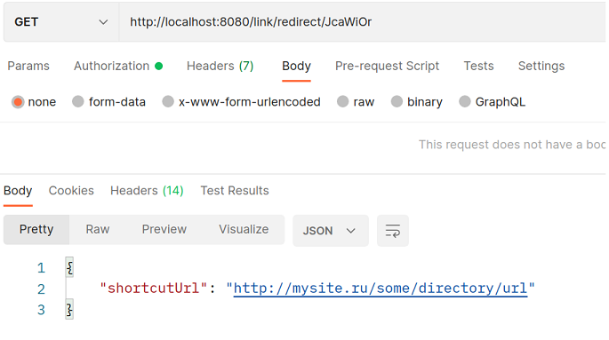
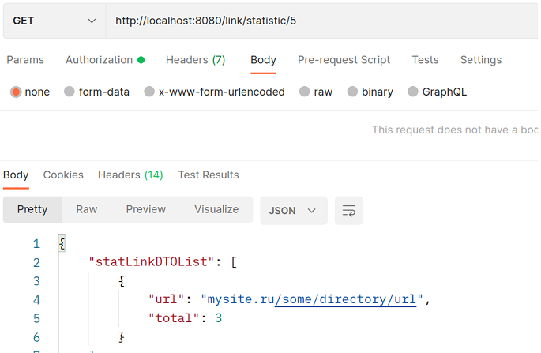

# Приложение ShortcutURL

## Описание проекта

Приложение реализует функционал REST-сервиса по сокращению ссылок. Позволяет пользователю получать сокращенные ссылки на
свой сайт. При использовании сокращенной ссылки сервис будет производить редирект на исходный URL-адрес. Взаимодействие
с сервисом происходит через простые http-запросы.

## Технологии

+ Java 16
+ Spring Boot 2
+ Spring Data JPA
+ Spring Security & JWT authorization
+ PostgreSQL
+ Liquibase

## Сборка

1. Скачайте файлы репозитория
2. Произвести сборку проекта: `mvn clean install`

## Запуск через Docker Compose

1. Создать директорию на сервере и скопировать файлы репозитория
2. Перейти в созданную директорию (корень проекта) и собрать приложение командой: `mvn install`
3. Собирать docker-образ приложения командой: `docker build -t shortcut .`
4. При необходимости отредактировать порты, используемые приложением в файле docker-compose.yml
5. Запустить приложение командой: `docker-compose up`

## Использование REST API

### Регистрация сайта

После старта приложения необходимо зарегистрироваться в нем, либо ввести свои логин и пароль. Регистрация производится
по названию сайта, например: `mysite.ru`.

### Авторизация

После регистрации для пользователя генерируются логин и пароль для доступа с систему. Их необходимо сохранить для
дальнейшего входа в систему. Флаг "registered" означает, был ли пользователь ранее зарегистрирован в системе. После
входа в систему пользователю присваивается уникальный токен, т.к. приложение использует JWT аутентификацию и
авторизацию.

### Создание короткой ссылки

Для получения сокращенной ссылки необходимо выполнить запрос, передав в нем исходную ссылку. Поле "siteId" - это
уникальный идентификатор пользователя, который присваивается ему при регистрации. Глубина ссылки не имеет значения.
Результат будет отправлен в теле ответа.

Важно учитывать, что корневой адрес исходной ссылки должен быть таким же как название сайта указанное при регистрации,
например:

    адрес, указанный при регистрации - site.ru
    адрес, который можно использовать - site.ru/***
    адрес, который нельзя использовать - some-address.ru/***

### Перенаправление на исходный URL

Если воспользоваться полученной ссылкой, произойдет перенаправление по исходному url адресу

### Получение статистики

Приложение ведет статистику по количеству обращений к каждой хранящейся ссылке. Для получения статистики необходимо
выполнить соответствующий запрос.

